# Liver Tumor Detection and Segmentation

=======

Fodé DIOUF

---

## 1. Objectif du projet

Développer un système automatisé pour :
- **Classifier** les images de foie (sain vs pathologique) à l’aide du modèle **VGG16**.
- **Segmenter** les tumeurs à l’aide du modèle **U-Net**, afin de localiser précisément les zones pathologiques.

---

## 2. Problématique

> Comment automatiser la classification et la segmentation des tumeurs hépatiques à partir d’images CT tout en assurant précision et fiabilité clinique ?

### Défis :
- Variabilité des images CT
- Complexité des formes tumorales
- Nécessité d'une grande précision clinique

---

## 3. Approche et méthodologie

### Classification
- **Architecture :** VGG16
- **Objectif :** Distinguer les images saines des images contenant des tumeurs

### Segmentation
- **Architecture :** U-Net
- **Objectif :** Localiser précisément les zones tumorales

### Impact attendu
- Réduction du temps d’analyse pour les radiologues
- Amélioration de la précision du diagnostic

---

## 4. Implémentation

### Fichiers principaux :
- `dataset.py` : Chargement, prétraitement et préparation des données
- `lit_model.py` : Encapsulation des modèles avec PyTorch Lightning
- `train.py` : Entraînement des modèles
- `vgg16.py` : Implémentation du modèle VGG16
- `unet.py` : Implémentation du modèle U-Net

### Prédictions :
- `predict_classification.py` : Chargement d’un modèle VGG16 pour classification
- `predict_segmentation.py` : Chargement d’un modèle U-Net pour segmentation

---

## 5. Résultats expérimentaux

### 📊 **Classification (VGG16)**  
Chemin des graphiques : `./Graphs_Classification/`

- **Train Loss par Epoch**  
  

- **Train Accuracy par Epoch**  
  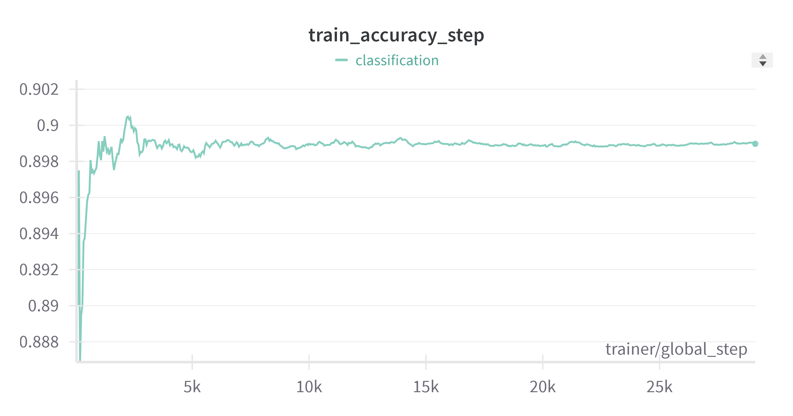

- **Train Loss par Step**  
  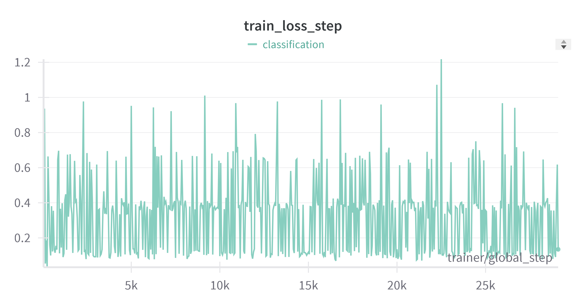

- **Train Accuracy par Step**  
  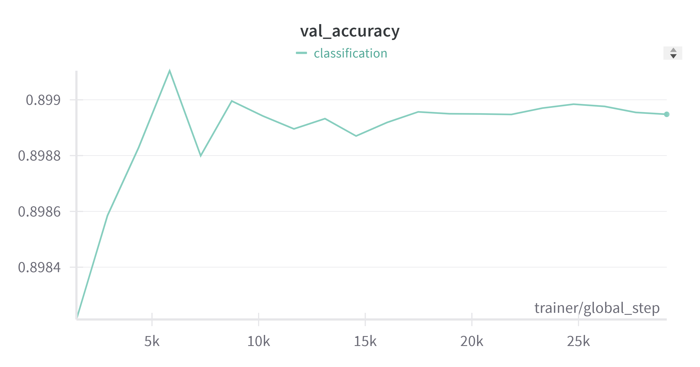

- **Validation Loss**  
  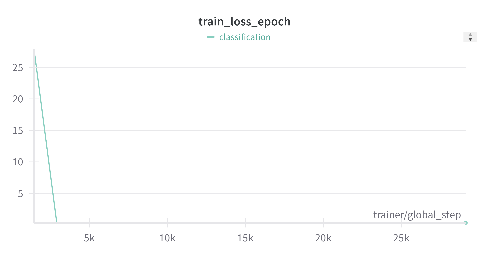

- **Validation Accuracy**  
  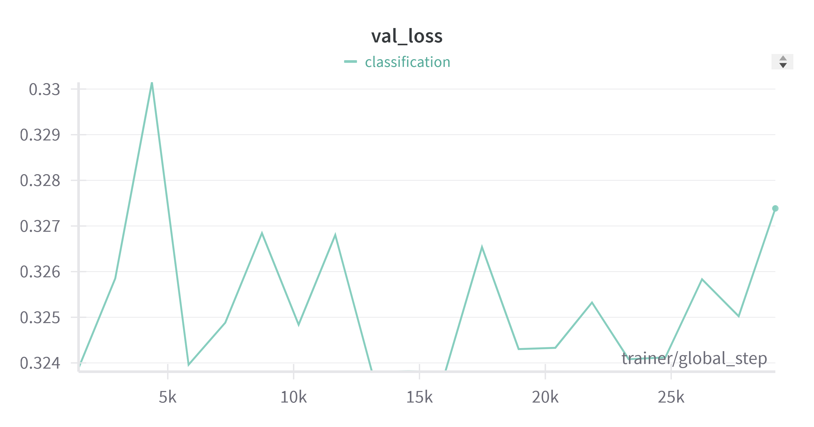

---

### 🟥 **Segmentation (U-Net)** 

- **Exemples de segmentation sur le test**  
  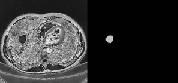  
  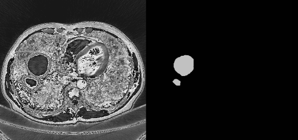  
  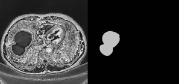  
  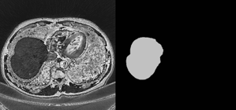
 
Chemin des graphiques : `./Graphs_Segmentation/`

- **Validation Dice Score**  
  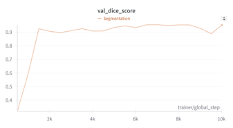

- **Train Dice Score par Epoch**  
  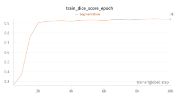

- **Validation Loss**  
  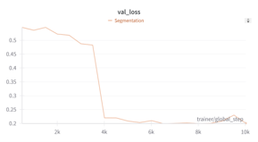

- **Train Loss par Epoch**  
  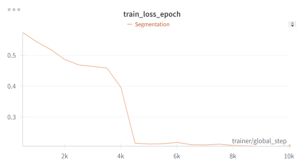

---

## 6. Conclusion

### Ce que nous avons appris :
- Rôle crucial de l’IA en imagerie médicale
- Application concrète de VGG16 et U-Net dans un contexte réel
- Complexité des pipelines médicaux (prétraitement, annotation, évaluation)

### Difficultés rencontrées :
- Qualité et hétérogénéité des images CT
- Réglage fin des hyperparamètres pour éviter overfitting/sous-entraînement

---

## 7. Perspectives
- Amélioration du modèle de segmentation avec attention mechanism
- Entraînement sur des datasets plus riches et cliniquement annotés
- Intégration dans un outil complet d’aide au diagnostic médical

